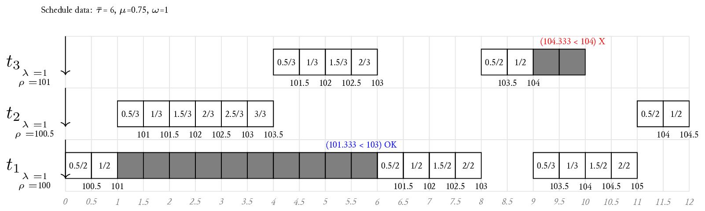

# Introduction

This is a small CLI tool written for the Advanced Operating Systems course to create realtime schedule diagrams from schedule plans. It provides several commands to simulate and print scheduling simulations. At the moment, the following schedulers are implemented:

- CFS (Linux CFS)
- FIFO (First-In, First-Out)
- SJF (Shortest Job First)
- SRTF (Shortest Remaining Time First)
- RR (Round-Robin)
- HRRN (Highest Response Ratio Next)

# Installation
To install the package and use it properly, you need to link it as a Bun package, so that Bun knows where the package is and of its existence.

To install, run the following:
```
cd <path-to-repo>
bun link && bun link aos-sched
```

# Usage
Only usage examples are provided, add the `--help` option to any command for a full list of its arguments and options.
The available commands are:

1. `dump`: This command is used to dump out examples of schedule plans which are wired in the tool (they are the one used for tests). These might have or not parameters specific to the scheduler itself. It takes two arguments: the scheduler to use and the example number. It returns the JSON representation of the specified schedule.

   ```sh
   bunx aos-sched dump cfs 0 | jq .
   ```

   ```json
   {
     "timer": 0.5,
     "runfor": 8,
     "class": {
       "type": "CFS",
       "latency": 6,
       "mingran": 0.75,
       "wgup": 1
     },
     "tasks": [
       {
         "index": 0,
         "name": "$t_1$",
         "lambda": 1,
         "start": 0,
         "events": [
           8
         ],
         "vrt": 100
       },
       ...
   ```

2. `gen`: This command is used to randomly generate a new schedule plan. Reasonable default values for the generator are present, but can be chosen via the command's options. As the `dump` command, it returns the JSON representation of the specified schedule.

  ```sh
  bunx aos-sched gen rr 3 --tm 1 --rf 12 --ms 2 --mei 4 --mat 6 --qt 2
  ```

2. `simulate`: This command is used to produce, by simulation, a realtime schedule from a schedule plan. It takes a single argument: the JSON file or stdin containing the schedule data (for examples of CFS schedules look at its [test files](./lib/cfs/fixtures.ts)). The scheduler to be used will be inferred from the data and format of the JSON schedule being passed as input to the command. It simulates the schedule using the specified scheduler and returns the JSON representation of the simulated schedule.

   ```sh
   bunx aos-sched dump cfs 0 | bunx aos-sched simulate
   ```

3. `export`: This command is used to export simulation data to available formats. It takes two arguments: the artifact name and the JSON file or stdin containing the simulation data. It exports the simulation data in the specified artifact format. At the moment there are three artifacts (`blank`, `complete`, `data`) that output latex source code.

   ```
   bunx aos-sched dump cfs 0 | bunx aos-sched simulate | bunx aos-sched export complete
   ```

4. `table`: This command is used to export a LaTeX table summarizing the schedule plan data. It takes two arguments: the artifact name and the JSON file or stdin containing the simulation data, or alternatively the raw schedule plan. At the moment there are two artifacts (`blank`, `complete`) that output LaTeX source code, which are observed ONLY if the command is fed with full simulation data (otherwise, `blank` is generated regardless of this option). `blank` creates the table filled with arrival and computation times, while `complete` also adds start, completion, waiting times and turnaround (if the simulation did not run for enough time to let a task exit, it will not have a completion time hence no turnaround can be determined as well, and therefore these fields will remain blank).

   ```sh
   # To extract a full, filled-out table
   bunx aos-sched dump cfs 0 | bunx aos-sched simulate | bunx aos-sched table complete
   ```
   ```sh
   # To extract a blank table
   bunx aos-sched dump cfs 0 | bunx aos-sched simulate | bunx aos-sched table blank
   # Or alternatively
   bunx aos-sched dump cfs 0 | bunx aos-sched table blank
   ```

# Examples

```sh
bunx aos-sched dump cfs 0 | bunx aos-sched simulate | bunx aos-sched export complete
```

will produce a latex file that when compiled and exported to png gives:



```sh
bunx aos-sched gen fifo 4 --tm 0.5 --rf 8 --ms 2 --mei 2 --mat 4 > tmp.json
cat tmp.json | bunx aos-sched simulate | bunx aos-sched export complete
cat tmp.json | bunx aos-sched table blank
cat tmp.json | bunx aos-sched simulate | bunx aos-sched table complete
```

will instead yield a randomly generated schedule and its tables, both empty and complete.